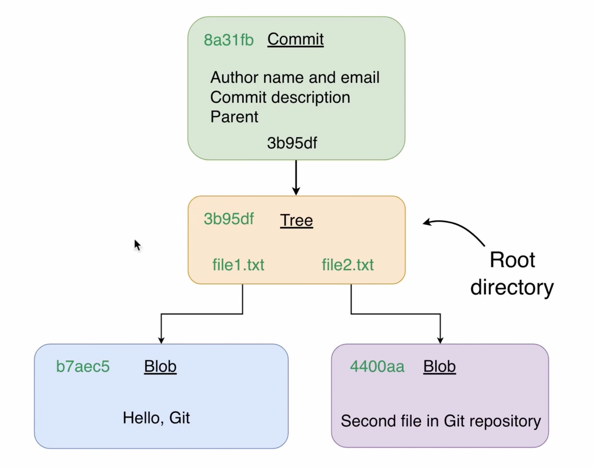

# **Git Operations**

## **Git Commits**

Commits have same structure as Object Blob and Tree in that it has:
  * Content
  * Object Type
  * Object Length

&nbsp;

The content of a `commit` have the following inside:
  * It own SHA1 hash
  * Author name and email
  * Commit description
  * Parent (optional)

&nbsp;

Commits allow us to store different versions (snapshots) of our project in the 
database. This gives us the ability to move to any version of the project by 
checking out the specific commit. This is done using a `pointer` to s specific 
Tree object in the `Git database`.

&nbsp;

&nbsp;

**`Note`**: Git `commit` is an object, every object must have a SHA1 hash
