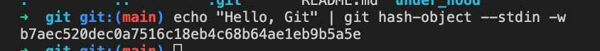
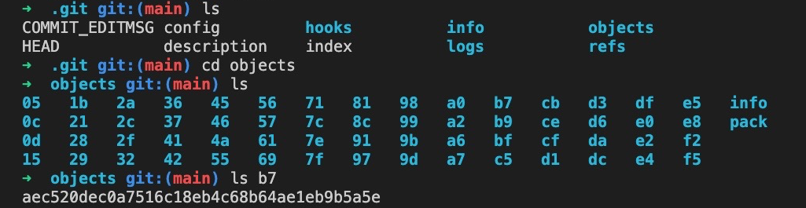
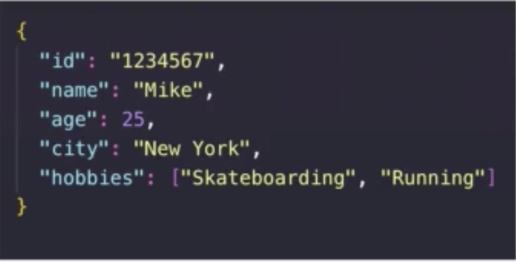
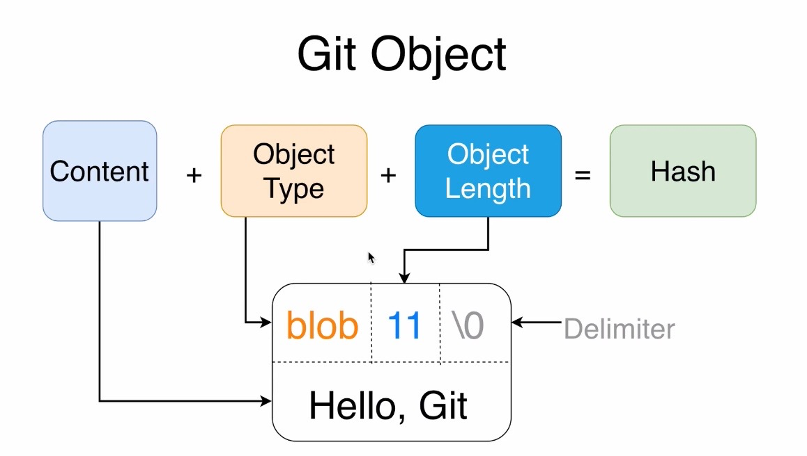
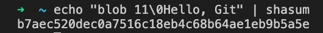

# **Git Objects**

Git has it's own file system which stores `objects` in the `obects directory`. There are several types of objects that Git can store. 

There are four main object types `Git` stores in order to store all necessary data required for file tracking and for tracking changes of files. They are:
  * Blob ~ Stores files with any extension which can be pictures, videos, text, etc.
  * Tree ~ Stores directories which can be empty or contain blobs and or other trees/directories
  * Commit ~ Allows us to store different versions of our project
  * Annotated Tag ~ Persistent text pointer to specific commit

&nbsp;

For management of `blobs` and `trees` use low level git commands:
  * <kbd>git hash-object</kbd> ~ `Creates` new object in Git structure
  * <kbd>git cat-file <`folder_name`><`file_name`></kbd> ~ `Reads` Git objects

 &nbsp;
 
## **Creating Trees and Blobs**

To create a `Blob` use <kbd>git hash-object</kbd>

To read a `Blob` use <kbd>git cat-file</kbd>

&nbsp; &nbsp; Options:
  * <kbd>-p</kbd> ~ Prints contents of object
  * <kbd>-s</kbd> ~ Prints size of object
  * <kbd>-t</kbd> ~ Prints type of object

To create a `Tree` use <kbd>git mktree</kbd>

When Git creates an object and stores it in it's file system, Git turns it into a Hash. That hash is then stored inside a folder it also creates.

&nbsp;

&nbsp;

&nbsp;

<kbd>echo [`"Hello, Git"`]</kbd> ~ Echos the input to Standard Output

<kbd>`|`</kbd> ~ Redirects the Standard Output to the next command

<kbd>--stdin</kbd> ~ This options allows <kbd>git hash-object</kbd> to take it's input from Standard Input

<kbd>-w</kbd> ~ Writes the file

&nbsp;

Git creates files and folders based on the hash which is created from the input using the `SHA1 Hash` function. The first two characters of the hash make up the folder name, while the rest of the hash equals the file name. The `Folder name` + `File name` equals the Hash.

&nbsp;

**`Note`**:

The new file or `Blob` was created ONLY in the Git repository, in the ".git/objects" folder.

Our project folder "Git" is still empty, if this was all that we created (not counting the hidden system .DS_Store file and .git folder).

&nbsp;

## **JSON vs. Git Dababase**

&nbsp;

&nbsp;

Similar to `JSON Objects` which store key value pairs, `Git` does the same thing. The keys are the hash which was generated by the value. The value is the actual data. So, the database is actually a set of key value pairs.

&nbsp;

**`Note`**:

The `Git` repository stores files independently in it's own "file system" in the "objects" directory. These files are separate and independent from the files stored on your computer. 

&nbsp;

## **Using Filenames**

In the previous example, we used the following command then used piping to redirect and use the command to create our blob  
  * `echo 'Hello, Git' | git hash-object --stdin -w`

Something to take notice of is that a filename was not required. The reason for this is that the file name is actually based on the `SHA1` hash of the object being stored. The object was created based on the contents of the file. However, if you did want to create an object using a file name, simply use the same command followed by the file name and the <kbd>-w</kbd> write to disk option. 
  * `git hash-object <filename> -w`

The filename of the object would still not be stored. Instead the `SHA1` hash created based on the contents of the file would end up being stored 😉 &nbsp; Also, size and type would be stored inside the blob too. This would cause the `SHA1` hash to be changed from had these not been included. 

&nbsp;

## **Contents of Git Object Blob**

&nbsp;

&nbsp;

To prove this, recall that when creating our blob using git hash-object we got 

&nbsp;

&nbsp;

If we type <kbd> echo 'blob 11\0Hello, Git' | shasum </kbd>, we get the same hash!

&nbsp;

